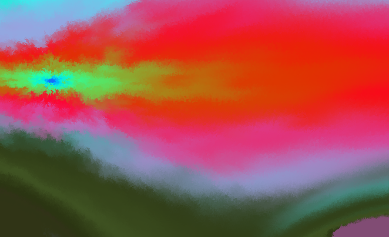
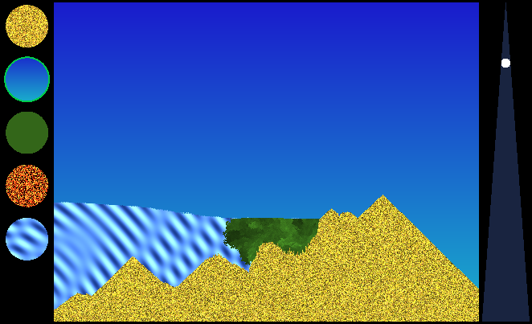
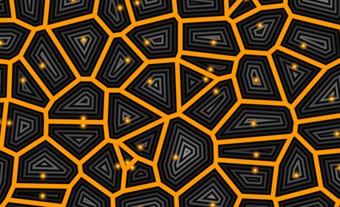
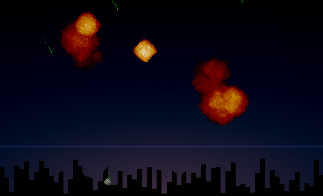
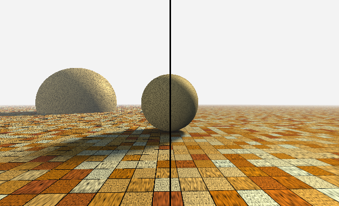
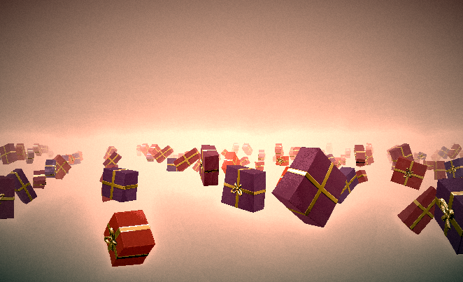
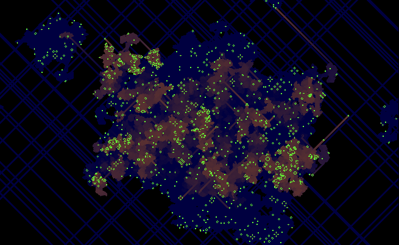
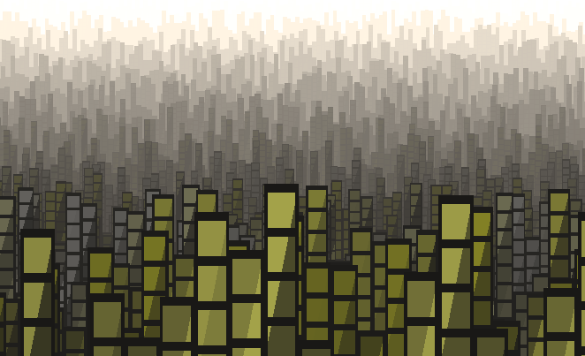
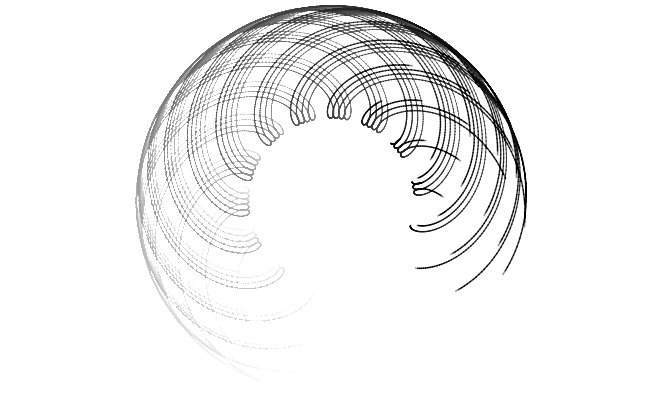
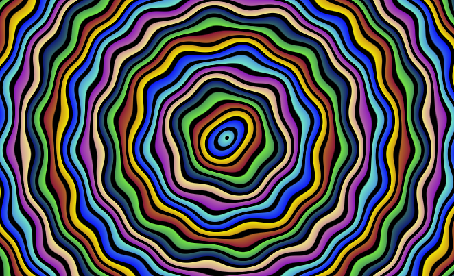

# Slang Playground Examples

This is an unofficial collection of assorted samples written in the [Slang Shading Language](https://shader-slang.org/) that are intended to run directly in the [Slang Playground](https://shader-slang.org/slang-playground/).

If you open this repository with [VSCode](https://code.visualstudio.com/), install the [Slang Extension](https://marketplace.visualstudio.com/items?itemName=shader-slang.slang-language-extension) to run and interact with these samples directly in your editor, even while offline.

## Samples

### Alan's Abstract "Art"

You have to click and drag the mouse all around before this one really gets going.

### Alan's Sandbox

Sand, Air, Plant, Fire, and Water, in a sandbox. Sand and water fall in air. Sand sinks in water. Plants grow in water. Fire burns plants. Paint your scene with the mouse.

### IQ's Better Voronoi Edges

The amazing Inigo Quilez demonstrates (originally on Shadertoy) how to calculate Voronoi cells without degenerate edges, by calculating the edge distance.

### Doomed City

Defend your city. Time for some panicked clicking! And explosions.

### IQ's Filtering Procedurals

Inigo Quilez demonstrates (originally on Shadertoy) a method for filtering of procedurally-generated textures.

### Holiday Gifts

Don't open until the holidays.

### Life with Trails

Conway's Game of Life, implemented in Slang, with adjustable trail and decay colors. Click and drag to place more life.

### Mini City

Just a few lines of shader code get you a whole city!

### Spirals

Lines swirl around while being drawn.

### Wiggle Rings

Some kinda funky fun shader with the wiggles.

